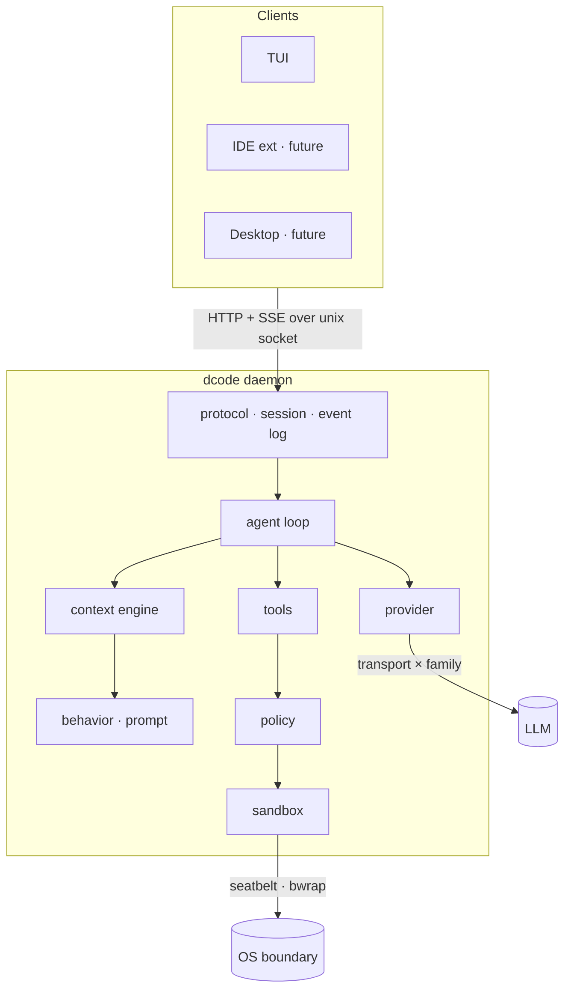

# dcode

🇧🇷 [Versão em português](README.pt-BR.md)


**Dreibox Code** — an agentic coding harness for the terminal, written in Go.

> **Status: specification phase.** There is no implementation yet — this repository
> currently contains architecture decisions and specs. Nothing here is installable or
> runnable. Starring it means you're interested in where it goes, not that it does
> anything today.

```
┌──────────────────────────────────────────────┬────────────────────────┐
│ ● dcode  MiniMax-M3  workspace-write  ctx 34%│ PLAN                   │
│                                              │                        │
│ ▸ Add CPF validation to checkout             │ ✓ 1 Map the flow       │
│                                              │ ✓ 2 Find existing check│
│   Found the flow. Validating before persist. │ ▸ 3 Implement CPF      │
│                                              │   4 Cover with tests   │
│   ⏺ read  src/checkout/handler.go   240 lines│ ⊘ 5 Run the suite      │
│   ⏺ edit  src/checkout/validate.go    +24 −2 │     └ missing dep      │
│     │ + func validateCPF(doc string) error { │                        │
│   ⏺ bash  go test ./src/checkout/  ✓ 12 pass │ 2 of 5 · 1 blocked     │
│                                              │                        │
│ › _                                          │ [p] hide               │
└──────────────────────────────────────────────┴────────────────────────┘
```

---

## Why another one

Four terminal coding agents already do this well, and each is genuinely good at
something different:

| | Language | License | Strongest at | Weakest at |
|---|---|---|---|---|
| [Claude Code](https://github.com/anthropics/claude-code) | TS + Rust | source-available | context engineering, tool design | cold start, single provider |
| [Codex CLI](https://github.com/openai/codex) | Rust | Apache-2.0 | OS-level sandboxing, governance | provider lock-in |
| [opencode](https://github.com/anomalyco/opencode) | TypeScript | MIT | 75+ providers, extensibility | runtime weight |
| [jcode](https://github.com/1jehuang/jcode) | Rust | MIT | startup latency, RAM per session | no sandbox at all |

The gap is the intersection none of them occupy: **session density _and_ a real
OS-enforced sandbox _and_ provider neutrality.** jcode has the performance and no
sandbox. Codex has the sandbox and is tied to one provider. opencode has the neutrality
and the heaviest runtime of the four.

That intersection is what this project is for.

---

## Design decisions

Five decisions, recorded before any code. Each is a load-bearing constraint on
everything that follows.

<details>
<summary><b>Go for the core</b> — chosen over Rust and TypeScript</summary>

Go gives roughly 90% of Rust's performance profile with the best CLI/TUI tooling of any
language, a concurrency model that maps directly onto the problem (N sessions, SSE
streaming, PTY multiplexing), and the deepest contributor pool in this specific domain.

The honest version: **Go and Rust scored within noise of each other.** The weighted
matrix that produced this decision separated them by single digits on a 115-point scale,
which is not enough resolution to call one correct. Go's accepted cost is GC pressure
under many concurrent sessions — which attacks exactly the thesis above, so a per-session
memory target ships as a regression test from day one.
</details>

<details>
<summary><b>Sandbox and approvals are separate concerns</b> — borrowed wholesale from Codex</summary>

- **Sandbox** is a technical boundary enforced by the kernel — `read-only`,
  `workspace-write`, `full-access`. Apple Seatbelt on macOS, bubblewrap and Landlock on
  Linux, Windows Sandbox on Windows.
- **Approval policy** is an authorization decision, orthogonal to the boundary —
  `untrusted`, `on-request`, `never`.

Keeping them separate is what reduces approval fatigue. Harnesses that conflate the two
ask too often, users disable prompting entirely, and the security model becomes
decorative. That is the real failure mode — not the sophisticated attack, but the
exhausted user.
</details>

<details>
<summary><b>Append-only context</b> — the highest-leverage performance decision</summary>

**The context prefix is never mutated between turns.** Editing anything early in the
conversation invalidates the whole KV cache and re-bills the full prompt, in both latency
and money.

Consequences most harnesses get wrong:

- MCP tool schemas are advertised at startup from cache. A server that connects on turn 5
  and injects tool definitions invalidates the cache for the entire session.
- No timestamps, token counters, or volatile state in the system prompt.
- Compaction is rare and block-wise, never incremental.
</details>

<details>
<summary><b>Client-server from the first commit</b> — cheapest now, most expensive to retrofit</summary>

The core runs as a local daemon; the TUI is just one client. Desktop apps, IDE
extensions, shared sessions and remote execution all fall out of it, and none of them fit
into a TUI monolith.
</details>

<details>
<summary><b>Provider-agnostic, with a real adaptation layer</b> — transport × family</summary>

Not just endpoint swapping. Two orthogonal axes:

- **Transport** is the wire format (`openai`, `anthropic`). Reusable, carries no
  thresholds.
- **Family** is the adaptation — system prompt, tool schema, edit strategy. Carries the
  measured behavioral thresholds and the per-model turn limits.

MiniMax M3 forced this: it speaks **both dialects**, so a single axis would mean
duplicating the whole family. The safety consequence matters more than the code shape —
*"OpenAI-compatible" describes serialization, not behavior*, so treating a wire format as
a family would apply one model's measured thresholds to another.
</details>

---

## Architecture



The session is an **append-only event log**. Resume, multi-client attach and session
density all fall out of that one primitive — the same principle as the model context, one
layer up.

---

## Stack

| Concern | Choice | Why |
|---|---|---|
| Language | **Go 1.25+** | see design decisions |
| TUI | `bubbletea/v2` · `lipgloss/v2` · `bubbles/v2` | best TUI tooling of any language |
| Config | `pelletier/go-toml/v2` | typed, commentable, no indentation traps |
| Sandbox | `exec` of `sandbox-exec` / `bwrap` + `golang.org/x/sys` | **no cgo**, keeps the static binary |
| gitignore | `boyter/gocodewalker` | the dedicated libs are abandoned since 2018–2021 |
| IDs | `oklog/ulid/v2` | time-ordered, filename-safe |
| Transport | stdlib `net/http` | HTTP+SSE over a unix socket needs nothing more |

Two deliberate non-choices:

- **No gRPC.** No codegen step, reachable from a future web surface, debuggable with
  `curl --unix-socket`. The bottleneck is the model, not serialization — optimizing the
  wire would be optimizing the wrong place.
- **No bundled tooling.** `grep` and `glob` are native Go. The user's own toolchain —
  tests, linters, formatters — runs through `bash` with whatever the machine already has.
  Bundling a linter would fight the project's own config.

---

## How this is built

Spec-driven development using the **RPI protocol** — four `.spec.md` files sharing a
timestamp prefix, with strict precedence:

| File | Role | Rule |
|---|---|---|
| `.r.spec.md` | Research — context, user stories, business rules | Absolute truth. If code contradicts it, the code is wrong. |
| `.p.spec.md` | Planning — schemas, contracts, types | Use exactly the names and types defined. |
| `.config.spec.md` | Config — env vars, flags, infra constants | No new env var in code without an entry here. |
| `.i.spec.md` | Implementing — ordered execution checklist | Follow the order. |

Precedence: `.r` > `.p`/`.config` > `.i`.

### The interesting part: specs for non-deterministic behavior

A harness has a problem a CRUD app does not — its most important behavior is mediated by
a language model. You cannot write this as a schema:

> when an edit fails on an ambiguous match, the agent re-reads the file instead of
> retrying blind

So every `.r.spec.md` declares which regime its scope operates in — **deterministic**,
**model-mediated**, or **mixed** — and that declaration decides how it is verified:
assertion in `go test`, or a measured threshold over fixtures.

The corollary is an architectural goal, not an accident: **push as much behavior as
possible across the line into the deterministic side.** If context assembly is a pure
function of session state, it is exactly golden-testable — and append-only context makes
that natural, because the prefix is a pure function of history.

The same principle governs where a behavior rule lives. A rule that can be enforced in
code does not belong in a prompt at all; prompt is for what cannot be structurally
enforced. And **tool error messages are a behavior surface, not diagnostics** — they are
where recovery is taught, at the only moment it is relevant, at zero cost until it
happens.

Details in [`docs/conventions/SDD-HARNESS.md`](docs/conventions/SDD-HARNESS.md).

---

## Specs

| Spec | Regime | Covers |
|---|---|---|
| [client-server-protocol](docs/specs/architecture/client-server-protocol/) | deterministic | HTTP+SSE over unix socket, event log, approval flow |
| [context-engine](docs/specs/architecture/context-engine/) | deterministic | the pure `Assemble`, compaction planning |
| [provider-adapter](docs/specs/architecture/provider-adapter/) | mixed | transport × family, error classes, retry |
| [agent-loop](docs/specs/architecture/agent-loop/) | mixed | the turn cycle, limits, parallel tools, recovery |
| [sandbox-policy](docs/specs/architecture/sandbox-policy/) | deterministic | the two orthogonal axes, OS enforcement |
| [tool-suite](docs/specs/architecture/tool-suite/) | deterministic | read, write, edit, glob, grep, bash, plan |
| [behavior-definition](docs/specs/architecture/behavior-definition/) | mixed | prompt layers, reminders, intrinsic planning |
| [configuration](docs/specs/architecture/configuration/) | deterministic | XDG layout, precedence chain, commands |
| [client-tui](docs/specs/architecture/client-tui/) | deterministic | layout, plan panel, approval modal |
| [distribution](docs/specs/architecture/distribution/) | deterministic | install, signed release, update |

---

## Roadmap

| Phase | Delivers | Milestone |
|---|---|---|
| **0** | `go.mod`, CI with `-race`, 90% gate, `CGO_ENABLED=0` | — |
| **1** | protocol type vocabulary | — |
| **2** | context engine — the pure `Assemble` | — |
| **3** | provider — transport `openai`, family `minimax-m3` | — |
| **4** | minimal loop + `read` | 🎯 **first runnable agent** |
| **5** | full tool suite + read-before-edit invariant | — |
| **6** | sandbox and policy | 🎯 **the product thesis turns on** |
| **7** | event log and session | — |
| **8** | server — unix socket, SSE, approvals | — |
| **9** | TUI client | 🎯 **MVP** |

Beyond MVP: multiple providers, MCP, plugins, session sharing, desktop, IDE.

**Self-hosting milestone.** A pull request to dcode written end to end by dcode, passing
review and the 90% gate with no manual edits. It is the best eval the project has: its
own test suite and review checklist become the fitness function. Its bias mitigation is
mandatory — keep a non-Go codebase in the eval fixtures, or the agent gets excellent at
Go and mediocre elsewhere without the metric noticing.

---

## Repository layout

```
docs/
  conventions/            bilingual — X.md is English, X.pt-BR.md is Portuguese
    LANGUAGE.md           the bilingual policy itself
    SDD-HARNESS.md        applying spec-driven development to a harness
    TESTING.md            TDD, bug reproduction rule, coverage gate
    GO-CODE-REVIEW.md     Go review checklist, with product-specific checks
  brand/                  bilingual — mascot, logomark, palette, voxel maps
  specs/                  Portuguese only — see LANGUAGE.md section 3
    architecture/         cross-cutting specs
    domains/              feature specs
```

Implementation will live in `internal/` (everything that is not a public contract) and
`pkg/` (everything that is).

---

## Contributing

Too early for code contributions — the specs are still moving.

What is useful right now is argument. If a design decision above looks wrong, open an
issue and say why. The reasoning is written down precisely so it can be attacked: every
decision has a stated cost, and the Go-versus-Rust call in particular was close enough
that new information could flip it.

### Workflow

**GitHub Flow.** `main` is always deployable. Work happens on short-lived branches cut
from `main` and returns through a pull request.

```
main ──┬─────────────────────────┬──▶
       └── feat/event-log ── PR ─┘
```

Branch names follow the change type: `feat/`, `fix/`, `docs/`, `chore/`, `refactor/`. For
spec-driven work, use the spec slug without its timestamp — `feat/client-server-protocol`.

**[Conventional Commits](https://www.conventionalcommits.org/)** on every commit message
and PR title. Breaking changes carry `!` before the colon and explain the break in the
body. For anything marked `stable` in a `.p.spec.md`, a breaking change also requires a
`changelog/` entry and a major version bump.

Commits that change technical behavior must keep the corresponding spec in sync — a spec
is never allowed to go stale relative to the code.

**Authorship.** Commits carry a single author and no co-author trailers. Every commit is
attributable to one person; tooling that assisted does not get a byline.

### Testing

**TDD.** Test first, watch it fail, then write the code. A test that has never been seen
red is not a safety net.

**Every bug gets a reproducing test — before the fix.** Reproduce it in a failing test,
confirm it fails for the reported symptom, then fix it, and the same test passes
unmodified. A `fix:` PR without a new test is blocked. Regression tests are permanent.

**90% coverage gate**, with an explicit denominator: deterministic code in `internal/` and
`pkg/`. Generated code, `main` wiring, and model-mediated paths are excluded — the last
because it cannot be verified by assertion at all, only by measured thresholds over
fixtures. That exclusion is deliberate pressure in the right direction.

The gate is a floor, not a target. A test that exercises a line without asserting anything
is a review finding even when coverage is green.

Full rules in [`docs/conventions/TESTING.md`](docs/conventions/TESTING.md).

### Language

This project is bilingual. English is canonical and takes the bare filename; Portuguese
carries a `.pt-BR` suffix. The README and everything under `docs/conventions/` exist in
both, cross-linked at the top.

Two deliberate exceptions: **specs are Portuguese only**, because RPI makes `.r.spec.md`
the absolute truth and that rule needs exactly one source of truth — a drifted spec is
worse than a missing one because it still looks authoritative. **Commits and code comments
are English only**, because changelog tooling assumes a single language.

Full policy in [`docs/conventions/LANGUAGE.md`](docs/conventions/LANGUAGE.md).

---

## Brand

The mascot is three stacked boxes; the logomark is a **D** built from the same three
boxes. Its eye is the `⏺` that marks every execution line in the TUI, so the mark repeats
itself on screen instead of being applied on top.

Designed as three pieces that stack — the name becomes the object, and it prints without
supports. Files, palette and voxel maps in [`docs/brand/`](docs/brand/).

## License

[MIT](LICENSE) — the same license as opencode and jcode.
