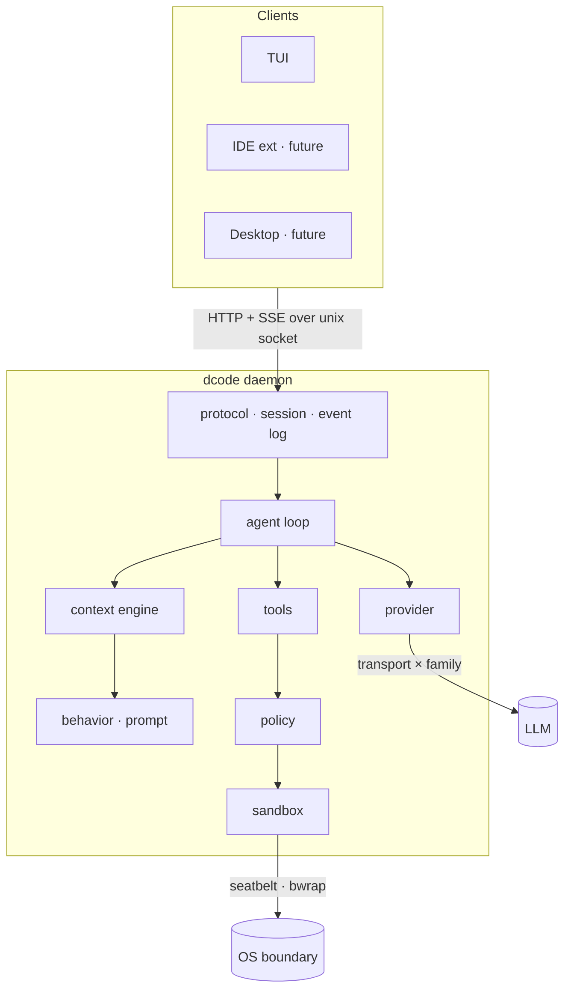

# dcode

🇧🇷 [Versão em português](README.pt-BR.md)

[](https://github.com/aguinelo/dcode/releases)


**The coding agent that measures its own behaviour — and publishes the score it
has not earned yet.**

Every terminal agent ships behaviour as prompt text and hopes. dcode ships it as
**contracts with thresholds**, runs them against a real model, and writes down what
came back — the 98% and the 5% alike.

Right now: **58 contracts declared, 19 actually measured.** That ratio is on the
front page on purpose. It is the most uncomfortable number in this repository and
the only honest one.

> **Status.** Published and installable. The daemon, the terminal client, the agent
> loop, the OS sandbox and the verification cycle all ship. Breaking changes are
> still expected — every contract removed, threshold lowered or tool description
> reworded is at least a MINOR, because the surface of this product is partly made
> of sentences.

```
┌────────────────────────────────────────────────────────────────────────┐
│ ● dcode   MiniMax-M3   workspace-write   ctx 34%                       │
│                                                                        │
│ ─  you ─────────────────────────────────────────────────────────────── │
│   /loop add CPF validation to checkout                                 │
│                                                                        │
│ ─  done, proposed ──────────────────────────────────────────────────── │
│   tests    go test ./src/checkout/...     red    — must turn green     │
│   vet      go vet ./...                   green  — must stay green     │
│   sign?  [enter] accept   [e] edit   [esc] cancel                      │
│                                                                        │
│ ─  cycle 2 ─────────────────────────────────────────────────────────── │
│   ⏺ read   src/checkout/handler.go                     240 lines       │
│   ⏺ edit   src/checkout/validate.go                       +24 −2       │
│   ⏺ bash   go test ./src/checkout/...                  ✓ 12 pass       │
│   done  tests ✓   vet ✓                          all criteria met      │
│                                                                        │
│ ┌────────────────────────────────────────────────────────────────────┐ │
│ │ ›                                           ^B files   ^R sessions │ │
│ └────────────────────────────────────────────────────────────────────┘ │
└────────────────────────────────────────────────────────────────────────┘
```

---

## Three things, and the third is the product

**It runs inside an OS boundary.** Apple Seatbelt on macOS, bubblewrap and Landlock
on Linux. Sandbox and approvals are separate axes, so it asks about what is
different in *kind* — not about everything, until you switch asking off and the
security model becomes decoration.

**It speaks to any model, and knows the difference.** Transport × family: the wire
format is reusable, the measured thresholds belong to the model. *"OpenAI-compatible"
describes serialization, not behaviour* — treating one as the other applies one
model's numbers to another.

**It knows when it is done, and when it went backwards.** You declare the finish
line as commands, or let it propose them and sign off. The loop runs them, feeds
the **failing output** back to the model, and when an attempt breaks something that
was passing it rolls that attempt back and says so out loud:

```
changelog:
  (it printed nothing) test -f CHANGELOG.md

tests:
  --- FAIL: TestSlugify
      slug_test.go:8: got "A B"
```

That block is not a log line. It is the reminder the model receives on the next
cycle. `finishes-work-that-takes-more-than-one-cycle` reads 100% today and read
70% at its first measurement, before the output travelled and before a round
ceiling stopped ending runs that were still working.

---

## Receipts

Behaviour you cannot assert, you measure. Every contract carries a threshold, a
model, a date, a run count and a rate — and the record is a Go value the build
reads, not a table someone keeps up to date.

| Contract | Rate | Runs | Model |
|---|---|---|---|
| `qualifier-proposes-commands` | 98% | 50 | MiniMax-M3 |
| `names-the-child-that-did-not-answer` | 98% | 50 | MiniMax-M3 |
| `keeps-writing-that-must-cohere` | 96% | 50 | MiniMax-M3 |
| `floor-yields-to-user` | 96% | 50 | MiniMax-M3 |
| `floor-does-not-ask` | 94% | 50 | MiniMax-M3 |
| `states-unmet-on-stall` | 94% | 50 | MiniMax-M3 |
| `fixes-what-the-output-named` | 100% | 20 | MiniMax-M3 |
| `finishes-work-that-takes-more-than-one-cycle` | 100% | 20 | MiniMax-M3 |
| `qualifier-declares-regression` | 80% | 20 | MiniMax-M3 |
| `delegates-writing-when-disjoint` | 50% | 50 | MiniMax-M3 |
| `floor-says-it-once` | 50% | 20 | MiniMax-M3 |
| **`floor-yields-to-project`** | **5%** | 20 | MiniMax-M3 |

**The last row stays.** It is the same rule as `floor-yields-to-user`, which reads
96% — the only difference is whether the instruction arrives in the turn or from a
project file. Position in the prefix turned out not to be precedence. It needs a
mechanism, not better wording, and it will not quietly improve while nobody looks.

**Five times in one week a low score turned out to be the instrument, not the
model** — a judge matching on the wrong field, a round ceiling that ended runs
still working, a criterion whose error message read as its own opposite. Each time
the number looked like a statement about the model and was a statement about the
scenario. That is what measuring buys you, and what a second opinion does not: a
reviewer would have agreed with all five.

Fifty-three of the 58 need a model to answer at all; five are settled by assertion.
The 34 contracts never run against one are the point of the badge. Each costs real
calls to a real model, and the number only moves by spending them.

---

## Installing

```bash
# the install script
curl -fsSL https://raw.githubusercontent.com/aguinelo/dcode/main/install.sh | sh

# from source
go install github.com/aguinelo/dcode/cmd/dcode@latest
```

### What the install script checks

**Nothing has to be installed first.** Of rustup, bun, deno, nvm, k3s and uv, not one
requires an external verification tool, and a first install is the worst moment to ask.

**The SHA-256 always.** A failure installs nothing and leaves nothing behind.

| Source of the expected digest | Covers | Needs |
|---|---|---|
| the digest the script carries | a **substituted release** | nothing |
| `checksums.txt` from the release | a corrupted or truncated download | nothing |
| the cosign signature over that file | a substituted release | `cosign`, if you have it |

The carried digest is the one worth explaining. `checksums.txt` travels from the same host
as the tarball, so on its own it cannot catch a swapped release — whoever replaces one
replaces the other, and the pair stays consistent with itself. The digest in the script
arrived by a different route: it is committed to `main`, where a release asset can be
replaced leaving no public trace and a line in a tracked file cannot, because changing it
is a commit.

A substituted release is covered by the carried digest **or** by the signature, and either
is enough. So the script says nothing at all when either held — telling you the signature
went unchecked while the check that matters passed by a route that does not depend on it is
noise dressed as diligence. When **neither** covered it, it says so, and points at the
installer that carries this release's digests. Never at a package to install.

`DCODE_VERSION` pins a version and `DCODE_INSTALL_DIR` chooses where. An installer carries
exactly one release's digests, so a pinned install of another version is that version's own
installer: `https://github.com/aguinelo/dcode/releases/download/vX.Y.Z/install.sh`.

`dcode update` installs a newer release on request, and never on its own, and needs no
extra package either. It applies the same rule as the install script — the carried digest
**or** the signature, either is enough — by reading the digests from the installer on
`main`. It then checks the downloaded binary actually runs, and only then swaps it, so
every failure leaves the working binary untouched.

One difference: where the install script warns, `update` **refuses**. There is a working
binary on the machine, so stopping costs a version and keeps everything.

### From source, for working on dcode itself

```bash
make install          # runs the gate, then installs to ~/.local/bin
make install-fast     # skips the gate, for the edit loop
make uninstall
```

`DCODE_INSTALL_DIR` chooses somewhere else. A local build says so in its own version
string — `0.0.0-dev+a91f2c4.dirty` — because a binary that presents itself exactly like a
published release is how a bug report costs an hour finding out it was never the published
code.

For the same reason `dcode update` refuses to replace a local build: one is normally
*ahead* of the last tag, so installing the latest release would be a downgrade wearing the
word "update". `--force` lifts the refusal.

---

## Running it

```bash
export DCODE_API_KEY=...

dcode                              # the terminal interface
dcode "add a test for the parser"  # one task, one exit code — for scripts and CI
dcode serve                        # the daemon, for clients that outlive one terminal
dcode tui --socket /path/to.sock   # attach a client to a running daemon
```

`dcode tui` attaches to a daemon when one answers and otherwise starts its own in-process.
The client speaks the protocol either way — the embedded daemon is a deployment detail,
not a second code path — so a session that outgrows one terminal moves to `dcode serve`
without the client changing anything.

### The verification cycle

`/loop` is the whole difference between a chat and a harness. It takes a goal and runs
until a **declared** finish line is met, rather than until the model says it is finished.

```
/loop specs/2026-08-25-home-page      # criteria read from tasks.md
/loop implement the customer registry # no criteria anywhere — it proposes them
```

Where the criteria come from decides very little — `.dcode/done.toml`, a spec
folder, or a proposal you sign, and one cycle consumes all of them. What the cycle
does is the part worth reading:

- **It runs every criterion before the work starts.** A criterion that is already
  green must stay green; one that is red is the target; one that does not run at all
  is *broken*, written into `done.toml` commented out, and never counted as passing.
- **When a criterion fails, its output reaches the model** — the tail of it, the
  failing assertion itself. A criterion that printed nothing has its command named
  instead, because "it failed" and "here is what it said" are different amounts of
  help.
- **When a cycle breaks something that was passing, that cycle is undone.** Not the
  turn, the cycle: the person's `/undo` and the loop's rollback answer two different
  questions and take two different snapshots. The model is told which names went
  backwards, and that the same change will be undone the same way.

### The credential

```bash
dcode login                    # read from a prompt that does not echo
dcode login --family claude    # a second key, for another family
dcode config                   # what is stored, masked, and where from
dcode login --reveal           # print it in full, on purpose
```

The key is never taken as an argument — an argument lands in shell history and is
visible in `ps`. It is stored in the OS keychain where there is one and in a `0600`
file where there is not, one credential per model family, chosen by
`credential.backend` so that what writes and what reads always agree.
`DCODE_API_KEY` still wins over anything stored.

`config.toml` refuses anything shaped like a secret, in any section, because that
file is meant to be versioned and synced.

Two commands need no key, and they are the audit pair:

```bash
dcode --dump-prompt          # exactly what would be sent to the model
dcode --config model.name    # a setting's effective value, and where it came from
```

### The boundary

By default the agent runs in `workspace-write` with `on-request` approvals: it may edit
inside the workspace, and anything crossing that boundary — a write outside it, or the
network — stops and asks. Without an approver it denies, because with nobody to ask the
only alternative is granting in silence.

Inside the workspace a short list of rules asks about the things that are different in
*kind* from ordinary work — writing `.git/**` (a hook runs on the next commit, outside the
sandbox) or `.dcode/**` (the agent's own configuration), and reading a secret (which sends
it to the model provider). They are **attention, not containment**: a command pattern is
avoided by `bash -c`, and what actually contains the agent is the sandbox.

```toml
[rules]
confirm_write   = [".git/**", ".dcode/**"]
confirm_read    = [".env", "**/*.pem"]
confirm_command = ["rm -rf*"]
```

A configured list replaces the default rather than adding to it, and `dcode config
rules.confirm_write` shows what is in force and where it came from.

### Configuring it

Everything is optional; the defaults are the product. Files live under `$DCODE_HOME`, or
the XDG directories when it is unset.

```
$DCODE_HOME/
  config.toml     settings — never credentials, which come from the environment
  AGENTS.md       instructions shared with other agent tools
  DCODE.md        instructions for dcode alone; wins where they disagree
  commands/       your own /commands — markdown with frontmatter
  skills/         guidance loaded only when its trigger fires
```

A workspace carries the same set under `<workspace>/.dcode/`, and its values win. An
unknown key in `config.toml` is an error rather than a warning: a typo that is silently
ignored is the most frustrating configuration bug there is.

### Inside the interface

The conversation gets the terminal. The file column starts hidden and `^B` summons it; the
conversation list is an overlay on `^R`, which is what that key means in the shell it was
borrowed from. Every question opens with a rule, so a screen of scrollback has a boundary
in it. Copy mode is `^O`.

That shape came from a measurement rather than a preference. Replaying a real recorded
session at four widths, the column and the panel took 61 of 132 columns and left 71 for the
conversation, while the same session at 99 columns — where both disappeared — gave it 99.
**Widening the terminal made the text narrower.**

While the model thinks, the last few lines of its reasoning stream dimmed on screen — the
only answer to "is it going somewhere sensible". Once it acts, that collapses to
`✻ thought for 4.2s · Tab`, because on a tool-calling turn the thinking runs five to ten
times the length of the answer and would bury the result it led to. It never enters the
history the model is sent. `behavior.show_reasoning = false` turns it off.

`/help` lists everything. `/plan` shows the plan in full, `/config <key>` answers where a
setting came from, `/model <name>` and `/clear` open a fresh session — the system prompt
is part of the prefix, and the prefix cannot be rewritten. `/init` writes DCODE.md for the
repository from what is already in it. A line starting with `!` is not sent to the model:
it runs, through the same tool and the same boundary, and the field says so from the first
character.

Typing while a turn is running queues the message; the queue drains as one turn when the
session goes idle. `^C` interrupts the turn rather than quitting. In the approval modal,
Enter denies.

---

## How this is built

Spec-driven development using the **RPI protocol** — four `.spec.md` files sharing a
timestamp prefix, with strict precedence:

| File | Role | Rule |
|---|---|---|
| `.r.spec.md` | Research — context, user stories, business rules | Absolute truth. If code contradicts it, the code is wrong. |
| `.p.spec.md` | Planning — schemas, contracts, types | Use exactly the names and types defined. |
| `.config.spec.md` | Config — env vars, flags, infra constants | No new env var in code without an entry here. |
| `.i.spec.md` | Implementing — ordered execution checklist | Follow the order. |

Precedence: `.r` > `.p`/`.config` > `.i`.

### The interesting part: specs for non-deterministic behavior

A harness has a problem a CRUD app does not — its most important behavior is mediated by
a language model. You cannot write this as a schema:

> when an edit fails on an ambiguous match, the agent re-reads the file instead of
> retrying blind

So every `.r.spec.md` declares which regime its scope operates in — **deterministic**,
**model-mediated**, or **mixed** — and that declaration decides how it is verified:
assertion in `go test`, or a measured threshold over fixtures. That is where the 58
contracts come from, and why measuring one costs money while asserting one costs a
millisecond.

The corollary is an architectural goal, not an accident: **push as much behavior as
possible across the line into the deterministic side.** If context assembly is a pure
function of session state, it is exactly golden-testable — and append-only context makes
that natural, because the prefix is a pure function of history.

The same principle governs where a behavior rule lives. A rule that can be enforced in
code does not belong in a prompt at all; prompt is for what cannot be structurally
enforced. And **tool error messages are a behavior surface, not diagnostics** — they are
where recovery is taught, at the only moment it is relevant, at zero cost until it
happens.

Details in [`docs/conventions/SDD-HARNESS.md`](docs/conventions/SDD-HARNESS.md).

### Numbers here are counted, not typed

The state table in [`CHANGELOG.md`](CHANGELOG.md) and the badges above are read by a test
that counts the tree: families, decision changelogs, contracts declared, contracts needing
a model, contracts settled by assertion, and contracts ever actually measured — in both
language editions, against the prose beside the table as well as the table itself. A number
inherited from the previous release fails the build.

It is the defect this repository keeps finding in itself — **a value copied from a truth
that moves** — and it was found sitting in the document that exists to prevent it.

---

## Specs

Eighteen families. Each declares its regime, and the regime decides how it is verified.

| Spec | Regime | Covers |
|---|---|---|
| [client-server-protocol](docs/specs/architecture/client-server-protocol/) | deterministic | HTTP+SSE over unix socket, event log, approval flow |
| [context-engine](docs/specs/architecture/context-engine/) | deterministic | the pure `Assemble`, compaction planning |
| [provider-adapter](docs/specs/architecture/provider-adapter/) | mixed | transport × family, error classes, retry |
| [agent-loop](docs/specs/architecture/agent-loop/) | mixed | the turn cycle, limits, parallel tools, recovery |
| [sandbox-policy](docs/specs/architecture/sandbox-policy/) | deterministic | the two orthogonal axes, OS enforcement |
| [tool-suite](docs/specs/architecture/tool-suite/) | deterministic | read, write, edit, glob, grep, bash, plan |
| [behavior-definition](docs/specs/architecture/behavior-definition/) | mixed | prompt layers, reminders, intrinsic planning |
| [configuration](docs/specs/architecture/configuration/) | deterministic | XDG layout, precedence chain, commands |
| [client-tui](docs/specs/architecture/client-tui/) | deterministic | layout, plan panel, approval modal |
| [distribution](docs/specs/architecture/distribution/) | deterministic | install, signed release, update |
| [loop-command](docs/specs/architecture/loop-command/) | mixed | `/loop`, the sources of a `DoneSet`, the dedicated session |
| [done-qualifier](docs/specs/architecture/done-qualifier/) | mixed | proposing criteria, measuring them before the work, the signature |
| [failure-feedback](docs/specs/architecture/failure-feedback/) | deterministic | the failing criterion's output reaching the model |
| [recoverable-cycle](docs/specs/architecture/recoverable-cycle/) | deterministic | detecting a regression, undoing the cycle that caused it |
| [working-defaults](docs/specs/architecture/working-defaults/) | mixed | the floor, and who may replace it |
| [delegated-writing](docs/specs/architecture/delegated-writing/) | mixed | when writing is split between children, and who reports |
| [task-ledger](docs/specs/architecture/task-ledger/) | mixed | what is in flight, and what it cost |
| [learned-memory](docs/specs/architecture/learned-memory/) | mixed | what the agent discovers, versioned where people read it — **design only, not built** |

---

## Design decisions

Five decisions, recorded before any code. Each is a load-bearing constraint on
everything that follows.

<details>
<summary><b>Go for the core</b> — chosen over Rust and TypeScript</summary>

Go gives roughly 90% of Rust's performance profile with the best CLI/TUI tooling of any
language, a concurrency model that maps directly onto the problem (N sessions, SSE
streaming, PTY multiplexing), and the deepest contributor pool in this specific domain.

The honest version: **Go and Rust scored within noise of each other.** The weighted
matrix that produced this decision separated them by single digits on a 115-point scale,
which is not enough resolution to call one correct. Go's accepted cost is GC pressure
under many concurrent sessions — which attacks exactly the thesis above, so a per-session
memory target ships as a regression test from day one.
</details>

<details>
<summary><b>Sandbox and approvals are separate concerns</b> — borrowed wholesale from Codex</summary>

- **Sandbox** is a technical boundary enforced by the kernel — `read-only`,
  `workspace-write`, `full-access`. Apple Seatbelt on macOS, bubblewrap and Landlock on
  Linux, Windows Sandbox on Windows.
- **Approval policy** is an authorization decision, orthogonal to the boundary —
  `untrusted`, `on-request`, `never`.

Keeping them separate is what reduces approval fatigue. Harnesses that conflate the two
ask too often, users disable prompting entirely, and the security model becomes
decorative. That is the real failure mode — not the sophisticated attack, but the
exhausted user.
</details>

<details>
<summary><b>Append-only context</b> — the highest-leverage performance decision</summary>

**The context prefix is never mutated between turns.** Editing anything early in the
conversation invalidates the whole KV cache and re-bills the full prompt, in both latency
and money.

Consequences most harnesses get wrong:

- MCP tool schemas are advertised at startup from cache. A server that connects on turn 5
  and injects tool definitions invalidates the cache for the entire session.
- No timestamps, token counters, or volatile state in the system prompt.
- Compaction is rare and block-wise, never incremental.
</details>

<details>
<summary><b>Client-server from the first commit</b> — cheapest now, most expensive to retrofit</summary>

The core runs as a local daemon; the TUI is just one client. Desktop apps, IDE
extensions, shared sessions and remote execution all fall out of it, and none of them fit
into a TUI monolith.
</details>

<details>
<summary><b>Provider-agnostic, with a real adaptation layer</b> — transport × family</summary>

Not just endpoint swapping. Two orthogonal axes:

- **Transport** is the wire format (`openai`, `anthropic`). Reusable, carries no
  thresholds.
- **Family** is the adaptation — system prompt, tool schema, edit strategy. Carries the
  measured behavioral thresholds and the per-model turn limits.

MiniMax M3 forced this: it speaks **both dialects**, so a single axis would mean
duplicating the whole family. The safety consequence matters more than the code shape —
*"OpenAI-compatible" describes serialization, not behavior*, so treating a wire format as
a family would apply one model's measured thresholds to another.
</details>

---

## Architecture



The session is an **append-only event log**. Resume, multi-client attach and session
density all fall out of that one primitive — the same principle as the model context, one
layer up.

### Stack

| Concern | Choice | Why |
|---|---|---|
| Language | **Go 1.25+** | see design decisions |
| TUI | `bubbletea/v2` · `lipgloss/v2` · `bubbles/v2` | best TUI tooling of any language |
| Config | `pelletier/go-toml/v2` | typed, commentable, no indentation traps |
| Sandbox | `exec` of `sandbox-exec` / `bwrap` + `golang.org/x/sys` | **no cgo**, keeps the static binary |
| gitignore | `boyter/gocodewalker` | the dedicated libs are abandoned since 2018–2021 |
| IDs | `oklog/ulid/v2` | time-ordered, filename-safe |
| Transport | stdlib `net/http` | HTTP+SSE over a unix socket needs nothing more |

Two deliberate non-choices:

- **No gRPC.** No codegen step, reachable from a future web surface, debuggable with
  `curl --unix-socket`. The bottleneck is the model, not serialization — optimizing the
  wire would be optimizing the wrong place.
- **No bundled tooling.** `grep` and `glob` are native Go. The user's own toolchain —
  tests, linters, formatters — runs through `bash` with whatever the machine already has.
  Bundling a linter would fight the project's own config.

---

## Roadmap

| Delivered | |
|---|---|
| the protocol vocabulary, the event log, unix socket and SSE | ✅ |
| the pure `Assemble` and compaction planning | ✅ |
| provider — transport × family, both dialects | ✅ |
| policy and the OS sandbox | ✅ |
| the seven tools, and the agent loop | ✅ |
| behaviour, config, wiring, CLI | ✅ |
| TUI client, commands, skills, reminders, signed distribution | ✅ |
| `/loop`, the done qualifier, failure feedback, cycle rollback | ✅ |

Coverage is **93.3%**, the gate is 90% aggregate **and per package**, and the suite runs
under `-race` on macOS and Linux, gated on the union of the profiles.

**What is open, in order of how much it bothers us.**

1. **`floor-yields-to-project` at 5%.** Project instructions do not govern the built-in
   floor the way a user's prompt does. Same rule, different place. It needs a mechanism.
2. **40 declared contracts never measured.** Each costs real model calls.
3. Multiple providers, MCP, plugins, session sharing, desktop, IDE.

**Self-hosting milestone.** A pull request to dcode written end to end by dcode, passing
review and the coverage gate with no manual edits. It is the best eval the project has: its
own test suite and review checklist become the fitness function. Its bias mitigation is
mandatory — keep a non-Go codebase in the eval fixtures, or the agent gets excellent at
Go and mediocre elsewhere without the metric noticing.

---

## Prior art

Four terminal coding agents got here first, and each is genuinely good at something
different. The comparison is at the bottom rather than the top because it is credit, not
a pitch.

| | Language | License | Strongest at | Weakest at |
|---|---|---|---|---|
| [Claude Code](https://github.com/anthropics/claude-code) | TS + Rust | source-available | context engineering, tool design | cold start, single provider |
| [Codex CLI](https://github.com/openai/codex) | Rust | Apache-2.0 | OS-level sandboxing, governance | provider lock-in |
| [opencode](https://github.com/anomalyco/opencode) | TypeScript | MIT | 75+ providers, extensibility | runtime weight |
| [jcode](https://github.com/1jehuang/jcode) | Rust | MIT | startup latency, RAM per session | no sandbox at all |

The gap is the intersection none of them occupy: **session density _and_ a real
OS-enforced sandbox _and_ provider neutrality** — with the behaviour on top of it written
down as something that can fail a build.

---

## Repository layout

```
docs/
  conventions/            bilingual — X.md is English, X.pt-BR.md is Portuguese
    LANGUAGE.md           the bilingual policy itself
    SDD-HARNESS.md        applying spec-driven development to a harness
    TESTING.md            TDD, bug reproduction rule, coverage gate
    GO-CODE-REVIEW.md     Go review checklist, with product-specific checks
  brand/                  bilingual — mascot, logomark, palette, voxel maps
  specs/                  Portuguese only — see LANGUAGE.md section 3
    architecture/         cross-cutting specs
    domains/              feature specs
```

```
internal/
  protocol/       the wire vocabulary, no logic and no I/O
  contextengine/  the pure Assemble — where ADR-03 lives or dies
  provider/       transport × family, replay transport, credential redaction
  policy/         the two orthogonal axes, pure decision table
  sandbox/        seatbelt and bubblewrap, driven as binaries
  tools/          read write edit glob grep bash plan
  loop/           the turn cycle, the done qualifier, the loop command
  behavior/       the prompt builder
  evals/          the behavioural contracts, their judges, and what was measured
  config/         roots, precedence chain, config.toml, commands, instructions
  session/        the append-only event log, approvals, the session manager
  server/         the daemon: unix socket, protocol routes, SSE
  tui/            the terminal client — a pure reducer and a pure renderer
  update/         signature and checksum verification, atomic binary swap
  app/            the only package that reads the environment
pkg/client/       the reference client, and the first consumer of the protocol
cmd/dcode/        argument parsing and printing
install.sh        verifies before it installs, or installs nothing
```

---

## Contributing

Still early — the specs move faster than an outside PR can track. What is most useful
right now is **argument**. If a design decision above looks wrong, open an issue and say
why. The reasoning is written down precisely so it can be attacked: every decision has a
stated cost, and the Go-versus-Rust call in particular was close enough that new
information could flip it.

### Workflow

**GitHub Flow.** `main` is always deployable. Work happens on short-lived branches cut
from `main` and returns through a pull request.

```
main ──┬─────────────────────────┬──▶
       └── feat/event-log ── PR ─┘
```

Branch names follow the change type: `feat/`, `fix/`, `docs/`, `chore/`, `refactor/`. For
spec-driven work, use the spec slug without its timestamp — `feat/client-server-protocol`.

**One theme, one branch, one PR.** A theme is what fits in a PR title without the word
"and". A defect found while doing something else gets its own branch.

**[Conventional Commits](https://www.conventionalcommits.org/)** on every commit message
and PR title. Breaking changes carry `!` before the colon and explain the break in the
body. Behaviour is part of the contract: a contract removed, a threshold lowered, or a
tool description that changes meaning is at minimum a MINOR — SemVer reads signatures, and
part of this surface is made of sentences.

Commits that change technical behavior must keep the corresponding spec in sync — a spec
is never allowed to go stale relative to the code. Every change lands in
[`CHANGELOG.md`](CHANGELOG.md), on the branch that makes it.

**Authorship.** Commits carry a single author and no co-author trailers. Every commit is
attributable to one person; tooling that assisted does not get a byline.

### Testing

**TDD.** Test first, watch it fail, then write the code. A test that has never been seen
red is not a safety net.

**Every bug gets a reproducing test — before the fix.** Reproduce it in a failing test,
confirm it fails for the reported symptom, then fix it, and the same test passes
unmodified. A `fix:` PR without a new test is blocked. Regression tests are permanent.

**90% coverage gate, aggregate and per package**, with an explicit denominator:
deterministic code in `internal/` and `pkg/`. Generated code, `main` wiring, and
model-mediated paths are excluded — the last because it cannot be verified by assertion at
all, only by measured thresholds over fixtures. That exclusion is deliberate pressure in
the right direction.

The gate is a floor, not a target. A test that exercises a line without asserting anything
is a review finding even when coverage is green.

```bash
make check   # lint, race, coverage gate, build — the whole gate
make test    # the suite alone
make eval    # the behavioural contracts, against a real model, for real money
```

`make eval` is not in `make check` on purpose, and nothing in `make check` even compiles
it — so `make eval-build` runs in any PR that touches the contracts, or they rot in
silence.

Full rules in [`docs/conventions/TESTING.md`](docs/conventions/TESTING.md).

### Language

This project is bilingual. English is canonical and takes the bare filename; Portuguese
carries a `.pt-BR` suffix. The README and everything under `docs/conventions/` exist in
both, cross-linked at the top.

Two deliberate exceptions: **specs are Portuguese only**, because RPI makes `.r.spec.md`
the absolute truth and that rule needs exactly one source of truth — a drifted spec is
worse than a missing one because it still looks authoritative. **Commits and code comments
are English only**, because changelog tooling assumes a single language.

Full policy in [`docs/conventions/LANGUAGE.md`](docs/conventions/LANGUAGE.md).

---

## Brand

The mascot is three stacked boxes; the logomark is a **D** built from the same three
boxes. Its eye is the `⏺` that marks every execution line in the TUI, so the mark repeats
itself on screen instead of being applied on top.

Designed as three pieces that stack — the name becomes the object, and it prints without
supports. Files, palette and voxel maps in [`docs/brand/`](docs/brand/).

## License

[MIT](LICENSE) — the same license as opencode and jcode.
