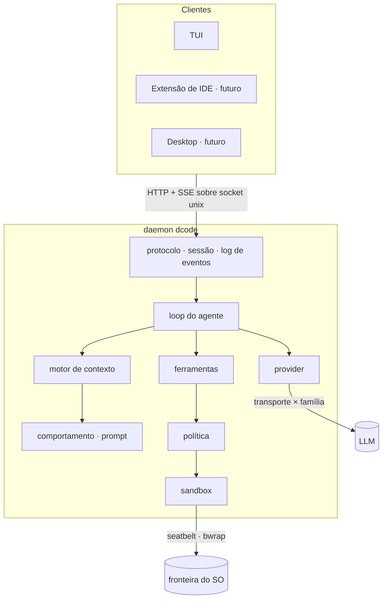

# dcode

🇬🇧 [English version](README.md)


**Dreibox Code** — um harness de codificação agêntico para o terminal, escrito em Go.

> **Status: fase de especificação.** Ainda não há implementação — este repositório contém
> hoje decisões de arquitetura e specs. Nada aqui é instalável ou executável. Dar uma
> estrela significa interesse no rumo do projeto, não que ele já faça algo.

```
┌──────────────────────────────────────────────┬────────────────────────┐
│ ● dcode  MiniMax-M3  workspace-write  ctx 34%│ PLANO                  │
│                                              │                        │
│ ▸ Adicionar validação de CPF no checkout     │ ✓ 1 Mapear o fluxo     │
│                                              │ ✓ 2 Localizar validação│
│   Localizei o fluxo. Vou validar antes da    │ ▸ 3 Implementar CPF    │
│   persistência.                              │   4 Cobrir com teste   │
│   ⏺ read  src/checkout/handler.go  240 linhas│ ⊘ 5 Rodar a suíte      │
│   ⏺ edit  src/checkout/validate.go   +24 −2  │     └ falta dependência│
│     │ + func validateCPF(doc string) error { │                        │
│   ⏺ bash  go test ./src/checkout/ ✓ 12 pass  │ 2 de 5 · 1 bloqueado   │
│                                              │                        │
│ › _                                          │ [p] ocultar            │
└──────────────────────────────────────────────┴────────────────────────┘
```

---

## Por que mais um

Quatro agentes de codificação de terminal já fazem isso bem, e cada um é genuinamente bom
em algo diferente:

| | Linguagem | Licença | Mais forte em | Mais fraco em |
|---|---|---|---|---|
| [Claude Code](https://github.com/anthropics/claude-code) | TS + Rust | source-available | engenharia de contexto, design de ferramentas | cold start, provider único |
| [Codex CLI](https://github.com/openai/codex) | Rust | Apache-2.0 | sandbox aplicado pelo SO, governança | amarração a um provider |
| [opencode](https://github.com/anomalyco/opencode) | TypeScript | MIT | 75+ providers, extensibilidade | peso do runtime |
| [jcode](https://github.com/1jehuang/jcode) | Rust | MIT | latência de inicialização, RAM por sessão | nenhum sandbox |

A lacuna é a interseção que nenhum deles ocupa: **densidade de sessão _e_ um sandbox real
aplicado pelo sistema operacional _e_ neutralidade de provider.** jcode tem a performance
e nenhum sandbox. Codex tem o sandbox e é preso a um provider. opencode tem a neutralidade
e o runtime mais pesado dos quatro.

Essa interseção é a razão deste projeto existir.

---

## Decisões de arquitetura

Cinco decisões, registradas antes de qualquer código. Cada uma é restrição estrutural
sobre tudo que vem depois.

<details>
<summary><b>Go no núcleo</b> — escolhido sobre Rust e TypeScript</summary>

Go entrega cerca de 90% do perfil de performance do Rust com o melhor ferramental de CLI e
TUI de qualquer linguagem, um modelo de concorrência que cai diretamente sobre o problema
(N sessões, streaming SSE, multiplexação de PTY) e o pool de contribuidores mais denso
neste domínio específico.

A versão honesta: **Go e Rust ficaram dentro do ruído um do outro.** A matriz ponderada
que produziu esta decisão separou os dois por um dígito numa escala de 115 pontos, o que
não é resolução suficiente para chamar um de correto. O custo aceito do Go é pressão de GC
sob muitas sessões concorrentes — que ataca exatamente a tese acima, então uma meta de
memória por sessão entra como teste de regressão desde o primeiro dia.
</details>

<details>
<summary><b>Sandbox e aprovação são preocupações separadas</b> — copiado inteiro do Codex</summary>

- **Sandbox** é fronteira técnica aplicada pelo kernel — `read-only`, `workspace-write`,
  `full-access`. Apple Seatbelt no macOS, bubblewrap e Landlock no Linux, Windows Sandbox
  no Windows.
- **Política de aprovação** é decisão de autorização, ortogonal à fronteira —
  `untrusted`, `on-request`, `never`.

Manter os dois separados é o que reduz fadiga de aprovação. Harnesses que misturam
perguntam demais, o usuário desliga o prompt inteiro, e o modelo de segurança vira
decoração. Esse é o modo de falha real — não o ataque sofisticado, mas o usuário exausto.
</details>

<details>
<summary><b>Contexto append-only</b> — a decisão de performance de maior alavancagem</summary>

**O prefixo do contexto nunca é mutado entre turnos.** Editar qualquer coisa no início da
conversa invalida o cache KV inteiro e recobra o prompt completo, em latência e em
dinheiro.

Consequências que a maioria dos harnesses erra:

- Schemas de ferramenta MCP são anunciados no startup a partir de cache. Um servidor que
  conecta no turno 5 e injeta definições invalida o cache da sessão inteira.
- Nada de timestamp, contador de tokens ou estado volátil no system prompt.
- Compactação é rara e em bloco, nunca incremental.
</details>

<details>
<summary><b>Client-server desde o primeiro commit</b> — mais barato agora, mais caro de retrofitar</summary>

O núcleo roda como daemon local; o TUI é apenas um cliente. Aplicativo desktop, extensão
de IDE, sessão compartilhada e execução remota caem toda dela, e nenhuma cabe num monolito
de TUI.
</details>

<details>
<summary><b>Agnóstico de provider, com camada de adaptação real</b> — transporte × família</summary>

Não é só troca de endpoint. Dois eixos ortogonais:

- **Transporte** é o formato de fio (`openai`, `anthropic`). Reusável, não carrega limiar.
- **Família** é a adaptação — system prompt, schema de ferramenta, estratégia de edição.
  Carrega os limiares comportamentais medidos e os limites de turno por modelo.

O MiniMax M3 forçou isso: ele fala **os dois dialetos**, então um eixo só significaria
duplicar a família inteira. A consequência de segurança importa mais que a forma do
código — *"OpenAI-compatible" descreve serialização, não comportamento*, então tratar
formato de fio como família aplicaria a um modelo os limiares medidos de outro.
</details>

---

## Arquitetura



A sessão é um **log de eventos append-only**. Retomada, múltiplos clientes anexados e
densidade de sessão caem todos dessa única primitiva — o mesmo princípio do contexto do
modelo, uma camada acima.

---

## Stack

| Preocupação | Escolha | Por quê |
|---|---|---|
| Linguagem | **Go 1.25+** | ver decisões de arquitetura |
| TUI | `bubbletea/v2` · `lipgloss/v2` · `bubbles/v2` | melhor ferramental de TUI de qualquer linguagem |
| Config | `pelletier/go-toml/v2` | tipado, comentável, sem armadilha de indentação |
| Sandbox | `exec` de `sandbox-exec` / `bwrap` + `golang.org/x/sys` | **sem cgo**, preserva o binário estático |
| gitignore | `boyter/gocodewalker` | as libs dedicadas estão abandonadas desde 2018–2021 |
| IDs | `oklog/ulid/v2` | ordenável por tempo, seguro em nome de arquivo |
| Transporte | `net/http` da stdlib | HTTP+SSE sobre socket unix não precisa de mais nada |

Duas não-escolhas deliberadas:

- **Sem gRPC.** Sem etapa de codegen, alcançável por superfície web futura, depurável com
  `curl --unix-socket`. O gargalo é o modelo, não a serialização — otimizar o fio seria
  otimizar o lugar errado.
- **Sem ferramenta empacotada.** `grep` e `glob` são nativos em Go. O toolchain do próprio
  usuário — teste, linter, formatador — roda por `bash`, com o que a máquina já tem.
  Empacotar um linter brigaria com a config do projeto dele.

---

## Como isto é construído

Desenvolvimento guiado por especificação, usando o **protocolo RPI** — quatro arquivos
`.spec.md` que compartilham um prefixo de timestamp, com precedência estrita:

| Arquivo | Papel | Regra |
|---|---|---|
| `.r.spec.md` | Research — contexto, user stories, regras de negócio | Verdade absoluta. Se o código contradiz, o código está errado. |
| `.p.spec.md` | Planning — schemas, contratos, tipos | Use exatamente os nomes e tipos definidos. |
| `.config.spec.md` | Config — env vars, flags, constantes de infra | Nenhuma env var nova no código sem entrada aqui. |
| `.i.spec.md` | Implementing — checklist ordenado de execução | Siga a ordem. |

Precedência: `.r` > `.p`/`.config` > `.i`.

### A parte interessante: spec para comportamento não determinístico

Um harness tem um problema que uma aplicação CRUD não tem — seu comportamento mais
importante é mediado por um modelo de linguagem. Isto não se escreve como schema:

> quando uma edição falha por match ambíguo, o agente relê o arquivo em vez de tentar de
> novo às cegas

Então todo `.r.spec.md` declara em qual regime seu escopo opera — **determinístico**,
**mediado por modelo** ou **misto** — e essa declaração decide como ele é verificado:
asserção em `go test`, ou limiar medido sobre fixtures.

O corolário é objetivo de arquitetura, não acidente: **empurre o máximo de comportamento
possível para o lado determinístico da linha.** Se a montagem de contexto for função pura
do estado da sessão, ela é exatamente golden-testável — e o contexto append-only torna
isso natural, porque o prefixo é função pura do histórico.

O mesmo princípio decide onde uma regra de comportamento mora. Regra que pode ser aplicada
por código não pertence ao prompt; prompt é para o que não se consegue aplicar
estruturalmente. E **mensagem de erro de ferramenta é superfície de comportamento, não
diagnóstico** — é onde a recuperação é ensinada, no único momento em que é relevante, a
custo zero até acontecer.

Detalhes em [`docs/conventions/SDD-HARNESS.pt-BR.md`](docs/conventions/SDD-HARNESS.pt-BR.md).

---

## Specs

| Spec | Regime | Cobre |
|---|---|---|
| [client-server-protocol](docs/specs/architecture/client-server-protocol/) | determinístico | HTTP+SSE sobre socket unix, log de eventos, aprovação |
| [context-engine](docs/specs/architecture/context-engine/) | determinístico | o `Assemble` puro, plano de compactação |
| [provider-adapter](docs/specs/architecture/provider-adapter/) | misto | transporte × família, classes de erro, retry |
| [agent-loop](docs/specs/architecture/agent-loop/) | misto | ciclo do turno, limites, ferramentas em paralelo, recuperação |
| [sandbox-policy](docs/specs/architecture/sandbox-policy/) | determinístico | os dois eixos ortogonais, aplicação pelo SO |
| [tool-suite](docs/specs/architecture/tool-suite/) | determinístico | read, write, edit, glob, grep, bash, plan |
| [behavior-definition](docs/specs/architecture/behavior-definition/) | misto | camadas de prompt, lembretes, planejamento intrínseco |
| [configuration](docs/specs/architecture/configuration/) | determinístico | layout XDG, cadeia de precedência, comandos |
| [client-tui](docs/specs/architecture/client-tui/) | determinístico | layout, painel de plano, modal de aprovação |
| [distribution](docs/specs/architecture/distribution/) | determinístico | instalação, release assinado, atualização |

---

## Roteiro

| Fase | Entrega | Marco |
|---|---|---|
| **0** | `go.mod`, CI com `-race`, gate de 90%, `CGO_ENABLED=0` | — |
| **1** | vocabulário de tipos do protocolo | — |
| **2** | motor de contexto — o `Assemble` puro | — |
| **3** | provider — transporte `openai`, família `minimax-m3` | — |
| **4** | loop mínimo + `read` | 🎯 **primeiro agente executável** |
| **5** | conjunto de ferramentas + invariante read-before-edit | — |
| **6** | sandbox e política | 🎯 **a tese do produto liga** |
| **7** | log de eventos e sessão | — |
| **8** | servidor — socket unix, SSE, aprovações | — |
| **9** | cliente TUI | 🎯 **MVP** |

Depois do MVP: múltiplos providers, MCP, plugins, sessão compartilhada, desktop, IDE.

**Marco de auto-hospedagem.** Um pull request ao dcode escrito de ponta a ponta pelo
dcode, aprovado na revisão e passando o gate de 90%, sem edição manual. É a melhor eval
que o projeto tem: a própria suíte de testes e o checklist de revisão viram função de
aptidão. A mitigação de viés é obrigatória — manter uma base de código não-Go nas fixtures
de eval, senão o agente fica excelente em Go e medíocre no resto sem a métrica acusar.

---

## Estrutura do repositório

```
docs/
  conventions/            bilíngue — X.md é inglês, X.pt-BR.md é português
    LANGUAGE.md           a própria política bilíngue
    SDD-HARNESS.md        como aplicar SDD a um harness
    TESTING.md            TDD, regra de reprodução de bug, gate de cobertura
    GO-CODE-REVIEW.md     checklist de revisão de Go, com checks do produto
  brand/                  bilíngue — mascote, logotipo, paleta, mapas de voxel
  specs/                  só português — ver LANGUAGE.md, seção 3
    architecture/         specs transversais
    domains/              specs de funcionalidade
```

A implementação vai viver em `internal/` (tudo que não é contrato público) e `pkg/` (tudo
que é).

---

## Contribuindo

Cedo demais para contribuição de código — as specs ainda estão em movimento.

O que é útil agora é argumento. Se alguma decisão acima parecer errada, abra uma issue e
diga por quê. O raciocínio está escrito justamente para poder ser atacado: toda decisão
tem custo declarado, e a escolha Go contra Rust em particular ficou perto o bastante para
que informação nova a inverta.

### Workflow

**GitHub Flow.** `main` está sempre pronta para deploy. O trabalho acontece em branches de
vida curta cortadas de `main` e volta por pull request.

```
main ──┬─────────────────────────┬──▶
       └── feat/event-log ── PR ─┘
```

Nome de branch segue o tipo da mudança: `feat/`, `fix/`, `docs/`, `chore/`, `refactor/`.
Para trabalho guiado por spec, use o slug da spec sem o timestamp —
`feat/client-server-protocol`.

**[Conventional Commits](https://www.conventionalcommits.org/)** em toda mensagem de
commit e título de PR. Mudança quebrando contrato leva `!` antes dos dois-pontos e explica
a quebra no corpo. Para qualquer coisa marcada como `stable` num `.p.spec.md`, quebra
também exige entrada em `changelog/` e incremento de major.

Commit que muda comportamento técnico precisa manter a spec correspondente sincronizada —
spec nunca pode ficar obsoleta em relação ao código.

**Autoria.** Commit tem autor único e nenhum trailer de coautoria. Todo commit é
atribuível a uma pessoa; ferramenta que auxiliou não recebe crédito.

### Testes

**TDD.** Teste primeiro, veja falhar, depois escreva o código. Teste que nunca foi visto
vermelho não é rede de segurança.

**Todo bug ganha teste de reprodução — antes da correção.** Reproduza num teste que falha,
confirme que ele falha pelo sintoma relatado, então corrija, e o mesmo teste passa sem ser
alterado. PR de `fix:` sem teste novo é bloqueado. Teste de regressão é permanente.

**Gate de cobertura de 90%**, com denominador explícito: código determinístico em
`internal/` e `pkg/`. Código gerado, wiring de `main` e caminhos mediados por modelo ficam
de fora — o último porque não é verificável por asserção de forma alguma, só por limiar
medido sobre fixtures. Essa exclusão é pressão deliberada na direção certa.

O gate é piso, não meta. Teste que exercita uma linha sem afirmar nada é achado de revisão
mesmo com a cobertura verde.

Regras completas em [`docs/conventions/TESTING.pt-BR.md`](docs/conventions/TESTING.pt-BR.md).

### Idioma

Este projeto é bilíngue. Inglês é canônico e fica com o nome sem sufixo; português é a
tradução e leva o sufixo `.pt-BR`. O README e tudo em `docs/conventions/` existem nos
dois, com link cruzado no topo.

Duas exceções deliberadas: **specs são só em português**, porque o RPI define o
`.r.spec.md` como verdade absoluta e essa regra precisa de exatamente uma fonte da verdade
— spec divergente é pior que ausente, porque continua parecendo autoritativa. **Commits e
comentários de código são só em inglês**, porque ferramenta de changelog assume idioma
único.

Política completa em [`docs/conventions/LANGUAGE.pt-BR.md`](docs/conventions/LANGUAGE.pt-BR.md).

---

## Marca

O mascote são três caixas empilhadas; o logotipo é um **D** construído com as mesmas três
caixas. O olho dele é o `⏺` que marca cada linha de execução na TUI, então a marca se
repete na tela em vez de ser aplicada por cima.

Desenhado como três peças que encaixam — o nome vira o objeto, e imprime sem suporte.
Arquivos, paleta e mapas de voxel em [`docs/brand/`](docs/brand/).

## Licença

[MIT](LICENSE) — a mesma licença do opencode e do jcode.
