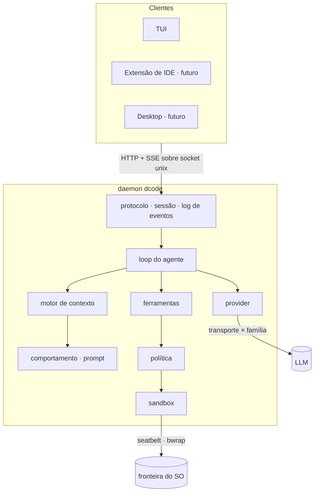

# dcode

🇬🇧 [English version](README.md)

[](https://github.com/aguinelo/dcode/releases)


**O agente de código que mede o próprio comportamento — e publica a nota que ainda
não conquistou.**

Todo agente de terminal entrega comportamento como texto de prompt e torce. O dcode
entrega como **contrato com limiar**, roda contra um modelo de verdade, e anota o que
voltou — o 98% e o 5% do mesmo jeito.

Hoje: **58 contratos declarados, 18 de fato medidos.** Essa razão está na capa de
propósito. É o número mais incômodo deste repositório e o único honesto.

> **Estado.** Publicado e instalável. O daemon, o cliente de terminal, o laço do
> agente, o sandbox do sistema operacional e o ciclo de verificação estão todos no ar.
> Ainda espere mudanças que quebram — contrato removido, limiar que desce ou descrição
> de ferramenta que muda de sentido é no mínimo MINOR, porque a superfície deste
> produto é em parte feita de frases.

```
┌────────────────────────────────────────────────────────────────────────┐
│ ● dcode   MiniMax-M3   workspace-write   ctx 34%                       │
│                                                                        │
│ ─  você ────────────────────────────────────────────────────────────── │
│   /loop validar CPF no checkout                                        │
│                                                                        │
│ ─  pronto, proposta ────────────────────────────────────────────────── │
│   testes   go test ./src/checkout/...   vermelho — tem que ficar verde │
│   vet      go vet ./...                 verde    — tem que continuar   │
│   assina?  [enter] aceitar   [e] editar   [esc] cancelar               │
│                                                                        │
│ ─  ciclo 2 ─────────────────────────────────────────────────────────── │
│   ⏺ read   src/checkout/handler.go                     240 linhas      │
│   ⏺ edit   src/checkout/validate.go                       +24 −2       │
│   ⏺ bash   go test ./src/checkout/...                  ✓ 12 pass       │
│   pronto  testes ✓   vet ✓                    todos os critérios ok    │
│                                                                        │
│ ┌────────────────────────────────────────────────────────────────────┐ │
│ │ ›                                       ^B arquivos   ^R sessões   │ │
│ └────────────────────────────────────────────────────────────────────┘ │
└────────────────────────────────────────────────────────────────────────┘
```

---

## Três coisas, e a terceira é o produto

**Roda dentro de uma fronteira do sistema operacional.** Apple Seatbelt no macOS,
bubblewrap e Landlock no Linux. Sandbox e aprovação são eixos separados, então ele
pergunta sobre o que é diferente **em natureza** — não sobre tudo, até você desligar a
pergunta e o modelo de segurança virar decoração.

**Fala com qualquer modelo, e sabe a diferença.** Transporte × família: o formato de
fio é reusável, os limiares medidos pertencem ao modelo. *"OpenAI-compatible" descreve
serialização, não comportamento* — tratar um como o outro aplica a um modelo os números
de outro.

**Sabe quando terminou, e quando andou para trás.** Você declara a linha de chegada
como comandos, ou deixa ele propor e assina embaixo. O laço roda os comandos, devolve
ao modelo a **saída de quem falhou**, e quando uma tentativa quebra algo que passava,
desfaz aquela tentativa e diz em voz alta:

```
changelog:
  (it printed nothing) test -f CHANGELOG.md

tests:
  --- FAIL: TestSlugify
      slug_test.go:8: got "A B"
```

Esse bloco não é linha de log. É o lembrete que o modelo recebe no ciclo seguinte.
`finishes-work-that-takes-more-than-one-cycle` marca 100% hoje e marcava 70% na
primeira medição, antes de a saída viajar e antes de um teto de rodadas parar de
encerrar execuções que ainda trabalhavam.

---

## As contas

Comportamento que não dá para afirmar, você mede. Todo contrato carrega limiar, modelo,
data, número de execuções e taxa — e o registro é um valor Go que o build lê, não uma
tabela que alguém mantém.

| Contrato | Taxa | Execuções | Modelo |
|---|---|---|---|
| `qualifier-proposes-commands` | 98% | 50 | MiniMax-M3 |
| `names-the-child-that-did-not-answer` | 98% | 50 | MiniMax-M3 |
| `keeps-writing-that-must-cohere` | 96% | 50 | MiniMax-M3 |
| `floor-yields-to-user` | 96% | 50 | MiniMax-M3 |
| `floor-does-not-ask` | 94% | 50 | MiniMax-M3 |
| `states-unmet-on-stall` | 94% | 50 | MiniMax-M3 |
| `fixes-what-the-output-named` | 100% | 20 | MiniMax-M3 |
| `finishes-work-that-takes-more-than-one-cycle` | 100% | 20 | MiniMax-M3 |
| `qualifier-declares-regression` | 80% | 20 | MiniMax-M3 |
| `delegates-writing-when-disjoint` | 50% | 50 | MiniMax-M3 |
| `floor-says-it-once` | 50% | 20 | MiniMax-M3 |
| **`floor-yields-to-project`** | **5%** | 20 | MiniMax-M3 |

**A última linha fica.** É a mesma regra do `floor-yields-to-user`, que marca 96% — a
única diferença é se a instrução chega no turno ou vem de um arquivo do projeto.
Posição no prefixo não era precedência. Isso precisa de mecanismo, não de texto melhor,
e não vai melhorar sozinho enquanto ninguém olha.

**Cinco vezes numa semana uma taxa baixa era o instrumento, não o modelo** — um juiz
casando pelo campo errado, um teto de rodadas que encerrava execuções ainda
trabalhando, um critério cuja mensagem de erro lia como o próprio oposto. Toda vez o
número parecia afirmação sobre o modelo e era afirmação sobre o cenário. É isso que
medir compra, e que uma segunda opinião não compra: um revisor teria concordado com as
cinco.

Cinquenta e três dos 58 precisam de modelo para serem respondidos; cinco se resolvem
por asserção. Os 35 contratos que nunca rodaram contra um são a razão do badge. Cada um
custa chamadas reais a um modelo real, e o número só anda gastando isso.

---

## Instalando

```bash
# pelo script
curl -fsSL https://raw.githubusercontent.com/aguinelo/dcode/main/install.sh | sh

# do fonte
go install github.com/aguinelo/dcode/cmd/dcode@latest
```

### O que o script de instalação confere

**Nada precisa ser instalado antes.** De rustup, bun, deno, nvm, k3s e uv, nenhum exige
ferramenta externa de verificação, e a primeira instalação é o pior momento para pedir.

**O SHA-256 sempre.** Falha nele não instala nada nem deixa resíduo.

| Fonte do digest esperado | Cobre | Precisa de |
|---|---|---|
| o digest que o próprio script carrega | **release substituído** | nada |
| o `checksums.txt` do release | download corrompido ou truncado | nada |
| a assinatura cosign sobre esse arquivo | release substituído | `cosign`, se você tiver |

O digest carregado é o que merece explicação. O `checksums.txt` viaja do mesmo host que o
tarball, então sozinho ele não pega release trocado — quem substitui um substitui o outro,
e o par continua coerente consigo mesmo. O digest no script chegou por outra rota: ele está
commitado na `main`, onde um asset de release se substitui sem rastro público e uma linha de
arquivo versionado não, porque mudá-la é um commit.

Release substituído é coberto pelo digest carregado **ou** pela assinatura, e qualquer um
basta. Então o script não diz nada quando um dos dois valeu — avisar que a assinatura ficou
por conferir, enquanto a verificação que importa passou por uma rota que não depende dela, é
ruído vestido de diligência. Quando **nenhum** dos dois cobriu, ele diz isso e aponta o
instalador que carrega os digests deste release. Nunca um pacote a instalar.

`DCODE_VERSION` trava a versão e `DCODE_INSTALL_DIR` escolhe o lugar. Um instalador carrega
os digests de exatamente um release, então a instalação fixada de outra versão é o
instalador daquela versão: `https://github.com/aguinelo/dcode/releases/download/vX.Y.Z/install.sh`.

`dcode update` instala uma versão nova sob demanda, nunca sozinho, e também não precisa de
pacote adicional. Ele aplica a mesma regra do script de instalação — o digest carregado
**ou** a assinatura, qualquer uma basta — lendo os digests do instalador da `main`. Depois
confere que o binário baixado de fato executa, e só então troca, de modo que qualquer falha
deixa o binário atual intacto.

Uma diferença: onde o script de instalação avisa, o `update` **recusa**. Há um binário
funcionando na máquina, então parar custa uma versão e preserva tudo.

### Do fonte, para trabalhar no próprio dcode

```bash
make install          # roda o gate e instala em ~/.local/bin
make install-fast     # pula o gate, para o laço de edição
make uninstall
```

`DCODE_INSTALL_DIR` escolhe outro lugar. Um build local diz que é local na própria
versão — `0.0.0-dev+a91f2c4.dirty` — porque um binário que se apresenta igual a um release
publicado é como um relato de bug vira uma hora perdida descobrindo que nunca era o código
publicado.

Pelo mesmo motivo o `dcode update` recusa substituir um build local: ele costuma estar
**à frente** da última tag, então instalar o release mais recente seria um downgrade
vestindo a palavra "atualizar". `--force` levanta a recusa.

---

## Rodando

```bash
export DCODE_API_KEY=...

dcode                                    # a interface de terminal
dcode "adicione um teste para o parser"  # uma tarefa, um código de saída — script e CI
dcode serve                              # o daemon, para clientes que vivem mais que um terminal
dcode tui --socket /caminho/do.sock      # conecta um cliente a um daemon em execução
```

`dcode tui` conecta a um daemon quando algum responde, e caso contrário sobe o seu próprio
no mesmo processo. O cliente fala o protocolo dos dois jeitos — o daemon embutido é
detalhe de implantação, não um segundo caminho de código — então uma sessão que cresce
além de um terminal migra para `dcode serve` sem o cliente mudar nada.

### O ciclo de verificação

`/loop` é a diferença inteira entre um chat e um harness. Ele recebe um objetivo e roda
até uma linha de chegada **declarada** ser cumprida, em vez de rodar até o modelo dizer
que terminou.

```
/loop specs/2026-08-25-home-page       # critérios lidos do tasks.md
/loop implemente o cadastro de clientes # nenhum critério em lugar nenhum — ele propõe
```

De onde vêm os critérios decide muito pouco — `.dcode/done.toml`, uma pasta de spec,
ou uma proposta que você assina, e um ciclo só consome todas. O que o ciclo faz é a
parte que vale ler:

- **Ele roda todo critério antes de o trabalho começar.** Critério que já está verde
  tem que continuar verde; o vermelho é o alvo; o que não roda de jeito nenhum está
  **quebrado**, entra no `done.toml` comentado, e nunca conta como aprovado.
- **Quando um critério falha, a saída dele chega ao modelo** — o final dela, a asserção
  que quebrou. Critério que não imprimiu nada tem o comando nomeado no lugar, porque
  "falhou" e "olha o que ele disse" são quantidades diferentes de ajuda.
- **Quando um ciclo quebra algo que passava, aquele ciclo é desfeito.** Não o turno, o
  ciclo: o `/undo` da pessoa e o rollback do laço respondem perguntas diferentes e tiram
  fotos diferentes. O modelo é informado de quais nomes andaram para trás, e de que a
  mesma mudança será desfeita do mesmo jeito.

### A credencial

```bash
dcode login                    # lê num prompt sem eco
dcode login --family claude    # uma segunda chave, para outra família
dcode config                   # o que está guardado, mascarado, e de onde vem
dcode login --reveal           # imprime por extenso, de propósito
```

A chave nunca é aceita como argumento — argumento entra no histórico do shell e
aparece no `ps`. Fica no keychain do SO onde houver e em arquivo `0600` onde não
houver, uma credencial por família de modelo, escolhida por `credential.backend`
para que quem escreve e quem lê sempre concordem. `DCODE_API_KEY` continua
vencendo o que estiver guardado.

O `config.toml` recusa qualquer coisa com cara de segredo, em qualquer seção,
porque esse arquivo é feito para ser versionado e sincronizado.

Dois comandos não precisam de chave, e são o par de auditoria:

```bash
dcode --dump-prompt          # exatamente o que iria para o modelo
dcode --config model.name    # valor efetivo de uma chave, e de onde ele veio
```

### A fronteira

Por default o agente roda em `workspace-write` com aprovação `on-request`: pode editar
dentro do workspace, e qualquer coisa que cruze essa fronteira — escrita fora dela, ou
rede — para e pergunta. Sem alguém para responder, ele nega: com ninguém para perguntar,
a única alternativa seria conceder em silêncio.

Dentro do workspace, uma lista curta de regras pergunta sobre o que é diferente **em
natureza** do trabalho comum — escrever em `.git/**` (um hook roda no próximo commit,
fora do sandbox) ou em `.dcode/**` (a configuração do próprio agente), e ler um segredo
(que manda o conteúdo ao provedor do modelo). São **atenção, não contenção**: padrão de
comando é contornado por `bash -c`, e quem contém de fato é o sandbox.

```toml
[rules]
confirm_write   = [".git/**", ".dcode/**"]
confirm_read    = [".env", "**/*.pem"]
confirm_command = ["rm -rf*"]
```

Lista configurada substitui o default em vez de somar, e `dcode config
rules.confirm_write` mostra o que está valendo e de onde veio.

### Configurando

Tudo é opcional; os defaults são o produto. Os arquivos moram sob `$DCODE_HOME`, ou nos
diretórios XDG quando ela não está definida.

```
$DCODE_HOME/
  config.toml     configuração — nunca credencial, que vem do ambiente
  AGENTS.md       instruções compartilhadas com outras ferramentas de agente
  DCODE.md        instruções só do dcode; vence onde houver divergência
  commands/       seus próprios /comandos — markdown com frontmatter
  skills/         orientação carregada apenas quando o gatilho bate
```

Um workspace carrega o mesmo conjunto em `<workspace>/.dcode/`, e os valores dele vencem.
Chave desconhecida no `config.toml` é erro, não aviso: erro de digitação silenciosamente
ignorado é a classe de bug de configuração mais frustrante que existe.

### Dentro da interface

A conversa fica com o terminal. A coluna de arquivos começa escondida e `^B` a chama; a
lista de conversas é um overlay em `^R`, que é o que essa tecla significa no shell de onde
ela foi emprestada. Toda pergunta abre com uma régua, para que uma tela de scrollback tenha
uma fronteira dentro dela. O modo de cópia é `^O`.

Esse formato veio de uma medição, não de uma preferência. Repetindo uma sessão real gravada
em quatro larguras, a coluna e o painel tomavam 61 de 132 colunas e sobravam 71 para a
conversa, enquanto a mesma sessão em 99 colunas — onde os dois sumiam — dava 99 a ela.
**Alargar o terminal deixava o texto mais estreito.**

Enquanto o modelo pensa, as últimas linhas do raciocínio passam esmaecidas na tela — é a
única resposta para "ele está indo para um lugar sensato". Quando ele age, aquilo colapsa em
`✻ thought for 4.2s · Tab`, porque em turno com ferramenta o pensamento roda de cinco a dez
vezes o tamanho da resposta e enterraria o resultado a que levou. Nunca entra no histórico
enviado ao modelo. `behavior.show_reasoning = false` desliga.

`/help` lista tudo. `/plan` mostra o plano completo, `/config <chave>` responde de onde
uma configuração veio, `/model <nome>` e `/clear` abrem sessão nova — o system prompt faz
parte do prefixo, e o prefixo não se reescreve. `/init` escreve o DCODE.md do repositório
a partir do que já existe nele. Uma linha começando com `!` não vai para o modelo: ela
roda, pela mesma ferramenta e pela mesma fronteira, e o campo avisa isso desde o primeiro
caractere.

Digitar durante um turno enfileira a mensagem; a fila é enviada como um único turno quando
a sessão volta a ficar ociosa. `^C` interrompe o turno em vez de sair. No modal de
aprovação, Enter nega.

---

## Como isto é construído

Desenvolvimento guiado por especificação, usando o **protocolo RPI** — quatro arquivos
`.spec.md` que compartilham um prefixo de timestamp, com precedência estrita:

| Arquivo | Papel | Regra |
|---|---|---|
| `.r.spec.md` | Research — contexto, user stories, regras de negócio | Verdade absoluta. Se o código contradiz, o código está errado. |
| `.p.spec.md` | Planning — schemas, contratos, tipos | Use exatamente os nomes e tipos definidos. |
| `.config.spec.md` | Config — env vars, flags, constantes de infra | Nenhuma env var nova no código sem entrada aqui. |
| `.i.spec.md` | Implementing — checklist ordenado de execução | Siga a ordem. |

Precedência: `.r` > `.p`/`.config` > `.i`.

### A parte interessante: spec para comportamento não determinístico

Um harness tem um problema que uma aplicação CRUD não tem — seu comportamento mais
importante é mediado por um modelo de linguagem. Isto não se escreve como schema:

> quando uma edição falha por match ambíguo, o agente relê o arquivo em vez de tentar de
> novo às cegas

Então todo `.r.spec.md` declara em qual regime seu escopo opera — **determinístico**,
**mediado por modelo** ou **misto** — e essa declaração decide como ele é verificado:
asserção em `go test`, ou limiar medido sobre fixtures. É daí que vêm os 58 contratos, e
é por isso que medir um custa dinheiro enquanto afirmar um custa um milissegundo.

O corolário é objetivo de arquitetura, não acidente: **empurre o máximo de comportamento
possível para o lado determinístico da linha.** Se a montagem de contexto for função pura
do estado da sessão, ela é exatamente golden-testável — e o contexto append-only torna
isso natural, porque o prefixo é função pura do histórico.

O mesmo princípio decide onde uma regra de comportamento mora. Regra que pode ser aplicada
por código não pertence ao prompt; prompt é para o que não se consegue aplicar
estruturalmente. E **mensagem de erro de ferramenta é superfície de comportamento, não
diagnóstico** — é onde a recuperação é ensinada, no único momento em que é relevante, a
custo zero até acontecer.

Detalhes em [`docs/conventions/SDD-HARNESS.pt-BR.md`](docs/conventions/SDD-HARNESS.pt-BR.md).

### Número aqui é contado, não digitado

A tabela de estado do [`CHANGELOG.pt-BR.md`](CHANGELOG.pt-BR.md) e os badges acima são
lidos por um teste que conta a árvore: famílias, changelogs de decisão, contratos
declarados, quantos precisam de modelo, quantos se resolvem por asserção e quantos de fato
já foram medidos — nas duas edições, contra a frase em prosa ao lado da tabela além da
tabela em si. Número herdado da release anterior reprova o build.

É o defeito que este repositório não para de encontrar em si mesmo — **um valor copiado de
uma verdade que se move** — e ele foi achado dentro do documento que existe para evitá-lo.

---

## Specs

Dezoito famílias. Cada uma declara seu regime, e o regime decide como ela é verificada.

| Spec | Regime | Cobre |
|---|---|---|
| [client-server-protocol](docs/specs/architecture/client-server-protocol/) | determinístico | HTTP+SSE sobre socket unix, log de eventos, aprovação |
| [context-engine](docs/specs/architecture/context-engine/) | determinístico | o `Assemble` puro, plano de compactação |
| [provider-adapter](docs/specs/architecture/provider-adapter/) | misto | transporte × família, classes de erro, retry |
| [agent-loop](docs/specs/architecture/agent-loop/) | misto | ciclo do turno, limites, ferramentas em paralelo, recuperação |
| [sandbox-policy](docs/specs/architecture/sandbox-policy/) | determinístico | os dois eixos ortogonais, aplicação pelo SO |
| [tool-suite](docs/specs/architecture/tool-suite/) | determinístico | read, write, edit, glob, grep, bash, plan |
| [behavior-definition](docs/specs/architecture/behavior-definition/) | misto | camadas de prompt, lembretes, planejamento intrínseco |
| [configuration](docs/specs/architecture/configuration/) | determinístico | layout XDG, cadeia de precedência, comandos |
| [client-tui](docs/specs/architecture/client-tui/) | determinístico | layout, painel de plano, modal de aprovação |
| [distribution](docs/specs/architecture/distribution/) | determinístico | instalação, release assinado, atualização |
| [loop-command](docs/specs/architecture/loop-command/) | misto | `/loop`, as origens da `DoneSet`, a sessão dedicada |
| [done-qualifier](docs/specs/architecture/done-qualifier/) | misto | propor critérios, medi-los antes do trabalho, a assinatura |
| [failure-feedback](docs/specs/architecture/failure-feedback/) | determinístico | a saída do critério que falhou chegando ao modelo |
| [recoverable-cycle](docs/specs/architecture/recoverable-cycle/) | determinístico | detectar a regressão, desfazer o ciclo que a causou |
| [working-defaults](docs/specs/architecture/working-defaults/) | misto | o piso, e quem pode substituí-lo |
| [delegated-writing](docs/specs/architecture/delegated-writing/) | misto | quando a escrita é dividida entre filhos, e quem relata |
| [task-ledger](docs/specs/architecture/task-ledger/) | misto | o que está em voo, e quanto custou |
| [learned-memory](docs/specs/architecture/learned-memory/) | misto | o que o agente descobre, versionado onde gente lê — **só desenho, não construído** |

---

## Decisões de arquitetura

Cinco decisões, registradas antes de qualquer código. Cada uma é restrição estrutural
sobre tudo que vem depois.

<details>
<summary><b>Go no núcleo</b> — escolhido sobre Rust e TypeScript</summary>

Go entrega cerca de 90% do perfil de performance do Rust com o melhor ferramental de CLI e
TUI de qualquer linguagem, um modelo de concorrência que cai diretamente sobre o problema
(N sessões, streaming SSE, multiplexação de PTY) e o pool de contribuidores mais denso
neste domínio específico.

A versão honesta: **Go e Rust ficaram dentro do ruído um do outro.** A matriz ponderada
que produziu esta decisão separou os dois por um dígito numa escala de 115 pontos, o que
não é resolução suficiente para chamar um de correto. O custo aceito do Go é pressão de GC
sob muitas sessões concorrentes — que ataca exatamente a tese acima, então uma meta de
memória por sessão entra como teste de regressão desde o primeiro dia.
</details>

<details>
<summary><b>Sandbox e aprovação são preocupações separadas</b> — copiado inteiro do Codex</summary>

- **Sandbox** é fronteira técnica aplicada pelo kernel — `read-only`, `workspace-write`,
  `full-access`. Apple Seatbelt no macOS, bubblewrap e Landlock no Linux, Windows Sandbox
  no Windows.
- **Política de aprovação** é decisão de autorização, ortogonal à fronteira —
  `untrusted`, `on-request`, `never`.

Manter os dois separados é o que reduz fadiga de aprovação. Harnesses que misturam
perguntam demais, o usuário desliga o prompt inteiro, e o modelo de segurança vira
decoração. Esse é o modo de falha real — não o ataque sofisticado, mas o usuário exausto.
</details>

<details>
<summary><b>Contexto append-only</b> — a decisão de performance de maior alavancagem</summary>

**O prefixo do contexto nunca é mutado entre turnos.** Editar qualquer coisa no início da
conversa invalida o cache KV inteiro e recobra o prompt completo, em latência e em
dinheiro.

Consequências que a maioria dos harnesses erra:

- Schemas de ferramenta MCP são anunciados no startup a partir de cache. Um servidor que
  conecta no turno 5 e injeta definições invalida o cache da sessão inteira.
- Nada de timestamp, contador de tokens ou estado volátil no system prompt.
- Compactação é rara e em bloco, nunca incremental.
</details>

<details>
<summary><b>Client-server desde o primeiro commit</b> — mais barato agora, mais caro de retrofitar</summary>

O núcleo roda como daemon local; o TUI é apenas um cliente. Aplicativo desktop, extensão
de IDE, sessão compartilhada e execução remota caem toda dela, e nenhuma cabe num monolito
de TUI.
</details>

<details>
<summary><b>Agnóstico de provider, com camada de adaptação real</b> — transporte × família</summary>

Não é só troca de endpoint. Dois eixos ortogonais:

- **Transporte** é o formato de fio (`openai`, `anthropic`). Reusável, não carrega limiar.
- **Família** é a adaptação — system prompt, schema de ferramenta, estratégia de edição.
  Carrega os limiares comportamentais medidos e os limites de turno por modelo.

O MiniMax M3 forçou isso: ele fala **os dois dialetos**, então um eixo só significaria
duplicar a família inteira. A consequência de segurança importa mais que a forma do
código — *"OpenAI-compatible" descreve serialização, não comportamento*, então tratar
formato de fio como família aplicaria a um modelo os limiares medidos de outro.
</details>

---

## Arquitetura



A sessão é um **log de eventos append-only**. Retomada, múltiplos clientes anexados e
densidade de sessão caem todos dessa única primitiva — o mesmo princípio do contexto do
modelo, uma camada acima.

### Stack

| Preocupação | Escolha | Por quê |
|---|---|---|
| Linguagem | **Go 1.25+** | ver decisões de arquitetura |
| TUI | `bubbletea/v2` · `lipgloss/v2` · `bubbles/v2` | melhor ferramental de TUI de qualquer linguagem |
| Config | `pelletier/go-toml/v2` | tipado, comentável, sem armadilha de indentação |
| Sandbox | `exec` de `sandbox-exec` / `bwrap` + `golang.org/x/sys` | **sem cgo**, preserva o binário estático |
| gitignore | `boyter/gocodewalker` | as libs dedicadas estão abandonadas desde 2018–2021 |
| IDs | `oklog/ulid/v2` | ordenável por tempo, seguro em nome de arquivo |
| Transporte | `net/http` da stdlib | HTTP+SSE sobre socket unix não precisa de mais nada |

Duas não-escolhas deliberadas:

- **Sem gRPC.** Sem etapa de codegen, alcançável por superfície web futura, depurável com
  `curl --unix-socket`. O gargalo é o modelo, não a serialização — otimizar o fio seria
  otimizar o lugar errado.
- **Sem ferramenta empacotada.** `grep` e `glob` são nativos em Go. O toolchain do próprio
  usuário — teste, linter, formatador — roda por `bash`, com o que a máquina já tem.
  Empacotar um linter brigaria com a config do projeto dele.

---

## Roteiro

| Entregue | |
|---|---|
| o vocabulário do protocolo, o log de eventos, socket unix e SSE | ✅ |
| o `Assemble` puro e o plano de compactação | ✅ |
| provider — transporte × família, os dois dialetos | ✅ |
| política e o sandbox do SO | ✅ |
| as sete ferramentas, e o loop do agente | ✅ |
| comportamento, config, wiring, CLI | ✅ |
| cliente TUI, comandos, skills, lembretes, distribuição assinada | ✅ |
| `/loop`, o qualificador de pronto, feedback de falha, rollback de ciclo | ✅ |

A cobertura é **93,4%**, o gate é 90% agregado **e por pacote**, e a suíte roda sob
`-race` no macOS e no Linux, com o gate sobre a união dos profiles.

**O que está aberto, na ordem do quanto incomoda.**

1. **`floor-yields-to-project` em 5%.** Instrução de projeto não governa o piso embutido
   como o prompt do usuário governa. Mesma regra, lugar diferente. Precisa de mecanismo.
2. **40 contratos declarados e nunca medidos.** Cada um custa chamadas reais ao modelo.
3. Múltiplos providers, MCP, plugins, sessão compartilhada, desktop, IDE.

**Marco de auto-hospedagem.** Um pull request ao dcode escrito de ponta a ponta pelo
dcode, aprovado na revisão e passando o gate de cobertura, sem edição manual. É a melhor eval
que o projeto tem: a própria suíte de testes e o checklist de revisão viram função de
aptidão. A mitigação de viés é obrigatória — manter uma base de código não-Go nas fixtures
de eval, senão o agente fica excelente em Go e medíocre no resto sem a métrica acusar.

---

## Quem chegou antes

Quatro agentes de codificação de terminal chegaram primeiro, e cada um é genuinamente bom
em algo diferente. A comparação está no rodapé em vez do topo porque é crédito, não pitch.

| | Linguagem | Licença | Mais forte em | Mais fraco em |
|---|---|---|---|---|
| [Claude Code](https://github.com/anthropics/claude-code) | TS + Rust | source-available | engenharia de contexto, design de ferramentas | cold start, provider único |
| [Codex CLI](https://github.com/openai/codex) | Rust | Apache-2.0 | sandbox aplicado pelo SO, governança | amarração a um provider |
| [opencode](https://github.com/anomalyco/opencode) | TypeScript | MIT | 75+ providers, extensibilidade | peso do runtime |
| [jcode](https://github.com/1jehuang/jcode) | Rust | MIT | latência de inicialização, RAM por sessão | nenhum sandbox |

A lacuna é a interseção que nenhum deles ocupa: **densidade de sessão _e_ um sandbox real
aplicado pelo sistema operacional _e_ neutralidade de provider** — com o comportamento em
cima disso escrito de um jeito que pode reprovar um build.

---

## Estrutura do repositório

```
docs/
  conventions/            bilíngue — X.md é inglês, X.pt-BR.md é português
    LANGUAGE.md           a própria política bilíngue
    SDD-HARNESS.md        como aplicar SDD a um harness
    TESTING.md            TDD, regra de reprodução de bug, gate de cobertura
    GO-CODE-REVIEW.md     checklist de revisão de Go, com checks do produto
  brand/                  bilíngue — mascote, logotipo, paleta, mapas de voxel
  specs/                  só português — ver LANGUAGE.md, seção 3
    architecture/         specs transversais
    domains/              specs de funcionalidade
```

```
internal/
  protocol/       o vocabulário de fio, sem lógica e sem I/O
  contextengine/  o Assemble puro — onde a ADR-03 vive ou morre
  provider/       transporte × família, replay, redação de credencial
  policy/         os dois eixos ortogonais, tabela de decisão pura
  sandbox/        seatbelt e bubblewrap, acionados como binários
  tools/          read write edit glob grep bash plan
  loop/           o ciclo do turno, o qualificador de pronto, o comando /loop
  behavior/       o construtor de prompt
  evals/          os contratos comportamentais, seus juízes, e o que foi medido
  config/         raízes, cadeia de precedência, config.toml, comandos, instruções
  session/        o log de eventos append-only, aprovações, o gerenciador de sessão
  server/         o daemon: socket unix, rotas do protocolo, SSE
  tui/            o cliente de terminal — um redutor puro e um renderizador puro
  update/         verificação de assinatura e checksum, troca atômica do binário
  app/            o único pacote que lê o ambiente
pkg/client/       o cliente de referência, e o primeiro consumidor do protocolo
cmd/dcode/        parsing de argumento e impressão
install.sh        verifica antes de instalar, ou não instala
```

---

## Contribuindo

Ainda cedo — as specs andam mais rápido do que um PR de fora consegue acompanhar. O que é
mais útil agora é **argumento**. Se alguma decisão acima parecer errada, abra uma issue e
diga por quê. O raciocínio está escrito justamente para poder ser atacado: toda decisão
tem custo declarado, e a escolha Go contra Rust em particular ficou perto o bastante para
que informação nova a inverta.

### Workflow

**GitHub Flow.** `main` está sempre pronta para deploy. O trabalho acontece em branches de
vida curta cortadas de `main` e volta por pull request.

```
main ──┬─────────────────────────┬──▶
       └── feat/event-log ── PR ─┘
```

Nome de branch segue o tipo da mudança: `feat/`, `fix/`, `docs/`, `chore/`, `refactor/`.
Para trabalho guiado por spec, use o slug da spec sem o timestamp —
`feat/client-server-protocol`.

**Um tema, uma branch, um PR.** Tema é o que cabe num título de PR sem a palavra "e".
Defeito encontrado enquanto se fazia outra coisa ganha a própria branch.

**[Conventional Commits](https://www.conventionalcommits.org/)** em toda mensagem de
commit e título de PR. Mudança quebrando contrato leva `!` antes dos dois-pontos e explica
a quebra no corpo. Comportamento faz parte do contrato: contrato removido, limiar que
desce, ou descrição de ferramenta que muda de sentido é no mínimo MINOR — o SemVer lê
assinaturas, e parte desta superfície é feita de frases.

Commit que muda comportamento técnico precisa manter a spec correspondente sincronizada —
spec nunca pode ficar obsoleta em relação ao código. Toda alteração entra no
[`CHANGELOG.pt-BR.md`](CHANGELOG.pt-BR.md), na branch que a faz.

**Autoria.** Commit tem autor único e nenhum trailer de coautoria. Todo commit é
atribuível a uma pessoa; ferramenta que auxiliou não recebe crédito.

### Testes

**TDD.** Teste primeiro, veja falhar, depois escreva o código. Teste que nunca foi visto
vermelho não é rede de segurança.

**Todo bug ganha teste de reprodução — antes da correção.** Reproduza num teste que falha,
confirme que ele falha pelo sintoma relatado, então corrija, e o mesmo teste passa sem ser
alterado. PR de `fix:` sem teste novo é bloqueado. Teste de regressão é permanente.

**Gate de cobertura: 90%, agregado e por pacote**, com denominador explícito: código
determinístico em `internal/` e `pkg/`. Código gerado, wiring de `main` e caminhos mediados
por modelo ficam de fora — o último porque não é verificável por asserção de forma alguma,
só por limiar medido sobre fixtures. Essa exclusão é pressão deliberada na direção certa.

O gate é piso, não meta. Teste que exercita uma linha sem afirmar nada é achado de revisão
mesmo com a cobertura verde.

```bash
make check   # lint, race, gate de cobertura, build — o gate inteiro
make test    # só a suíte
make eval    # os contratos comportamentais, contra modelo real, com dinheiro real
```

`make eval` está fora do `make check` de propósito, e nada no `make check` sequer compila
o que está atrás daquela tag — então `make eval-build` roda em todo PR que toca os
contratos, ou eles apodrecem em silêncio.

Regras completas em [`docs/conventions/TESTING.pt-BR.md`](docs/conventions/TESTING.pt-BR.md).

### Idioma

Este projeto é bilíngue. Inglês é canônico e fica com o nome sem sufixo; português é a
tradução e leva o sufixo `.pt-BR`. O README e tudo em `docs/conventions/` existem nos
dois, com link cruzado no topo.

Duas exceções deliberadas: **specs são só em português**, porque o RPI define o
`.r.spec.md` como verdade absoluta e essa regra precisa de exatamente uma fonte da verdade
— spec divergente é pior que ausente, porque continua parecendo autoritativa. **Commits e
comentários de código são só em inglês**, porque ferramenta de changelog assume idioma
único.

Política completa em [`docs/conventions/LANGUAGE.pt-BR.md`](docs/conventions/LANGUAGE.pt-BR.md).

---

## Marca

O mascote são três caixas empilhadas; o logotipo é um **D** construído com as mesmas três
caixas. O olho dele é o `⏺` que marca cada linha de execução na TUI, então a marca se
repete na tela em vez de ser aplicada por cima.

Desenhado como três peças que encaixam — o nome vira o objeto, e imprime sem suporte.
Arquivos, paleta e mapas de voxel em [`docs/brand/`](docs/brand/).

## Licença

[MIT](LICENSE) — a mesma licença do opencode e do jcode.
