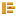

# Brand

🇧🇷 [Versão em português](README.pt-BR.md)

 &nbsp;&nbsp; 

Two marks with different jobs. The **mascot** is the character — stickers, physical
objects, anywhere personality helps. The **logomark** is the identifier — favicon,
headers, anywhere the name has to be recognised at a glance.

Same pixel grammar, same palette, so they read as one system.

## Files

| File | Use |
|---|---|
| `mascot.svg` | the three-box character |
| `logomark.svg` | the D — continuous stem, **primary** |
| `logomark-segmented.svg` | the D with the stem broken at the seams |
| `favicon.svg` | the logomark at favicon scale |
| `VOXELS.md` | the grids that generate both the SVGs and a 3D model |

## Palette

| Token | Hex | Role |
|---|---|---|
| highlight | `#EFC066` | top face of each box |
| body | `#E0A030` | front face — the primary colour |
| shadow | `#B87D1E` | bottom and right edge |
| eye | `#A8452A` | the marker, and nothing else |

Amber and terracotta are analogous hues, so the contrast does not come from hue — it
comes from **luminance**. `#E0A030` is light and `#A8452A` is dark. That is why the eye
survives at 16 px, where a hue difference alone would have collapsed into one blob.

Three amber tones give volume without an outline: lit face, front face, shaded face. The
same reasoning as an isometric render.

## The eye is the tool marker

`⏺` appears on every execution line in the TUI — `⏺ read`, `⏺ edit`, `⏺ bash`. Using it
as the eye makes every line on screen a repetition of the mark.

That is the opposite of a logo applied on top: it emerges from the product. It is also the
only feature the mascot has, which is enough personality to avoid the uncanny valley
without imposing a character on a tool.

## Why the segmented variant exists

The approved sketch broke the stem at the same rows as the bowl, which reads as three
separate pieces rather than a letter once it gets small. `logomark.svg` keeps the stem
continuous and breaks only the bowl — it still shows three boxes, and it still reads as a
D at 16 px.

`logomark-segmented.svg` is the original. Kept because the segmented version is stronger
at large sizes, where the letter is never in doubt and the construction is the point.

## Physical object

Designed as **three pieces that stack**, not one print. The name becomes the object: you
assemble the boxes.

| Property | Value |
|---|---|
| Pyramid | 12 → 10 → 6 voxels wide |
| Assembled height | 64 mm at 4 mm voxels · 96 mm at 6 mm |
| Supports | none — every piece prints on its own face |
| Overhang | none above 45° |
| Joint | 3 mm pin into a 3.2 mm hole, friction fit |
| Eye | 2-voxel through hole, or a 2 mm terracotta pin |

The wide base puts the centre of mass in the lower third, so it stands without ballast and
prints without a raft.

## Rules

- **Never recolour the eye.** It is the only fixed element; everything else can adapt.
- **Never add facial features.** One marker is the whole face.
- **Never outline in black.** Volume comes from the three amber tones.
- **Below 16 px, use the logomark**, not the mascot — the three boxes stop separating.
- The mascot must render inside the product, in the terminal. A mark that cannot appear in
  its own tool is external decoration.
